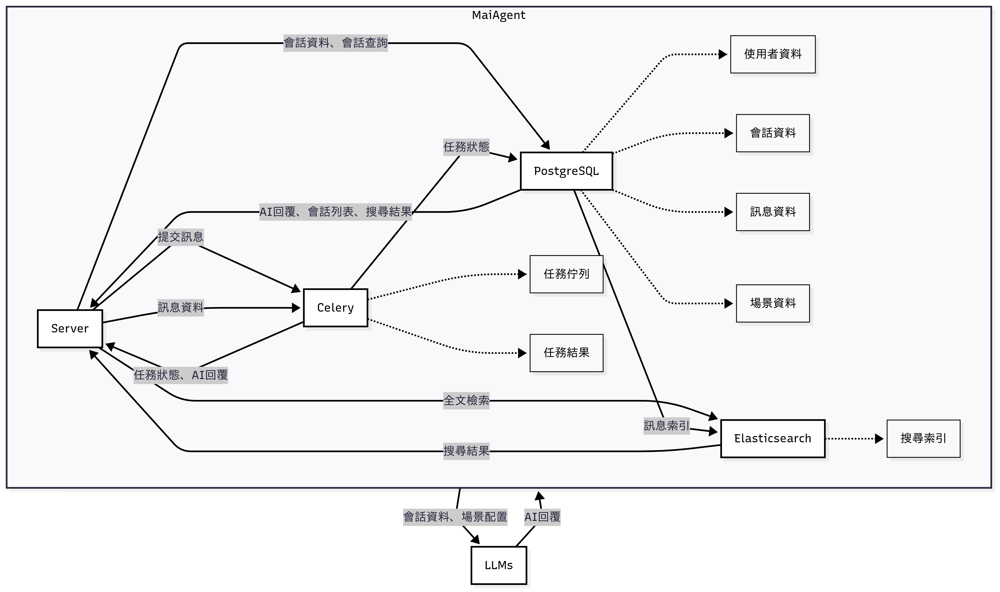
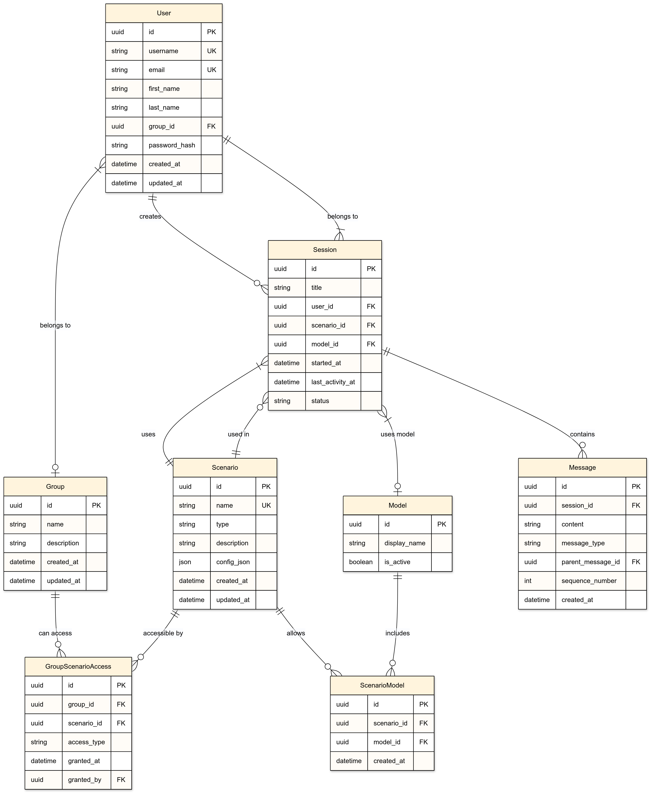
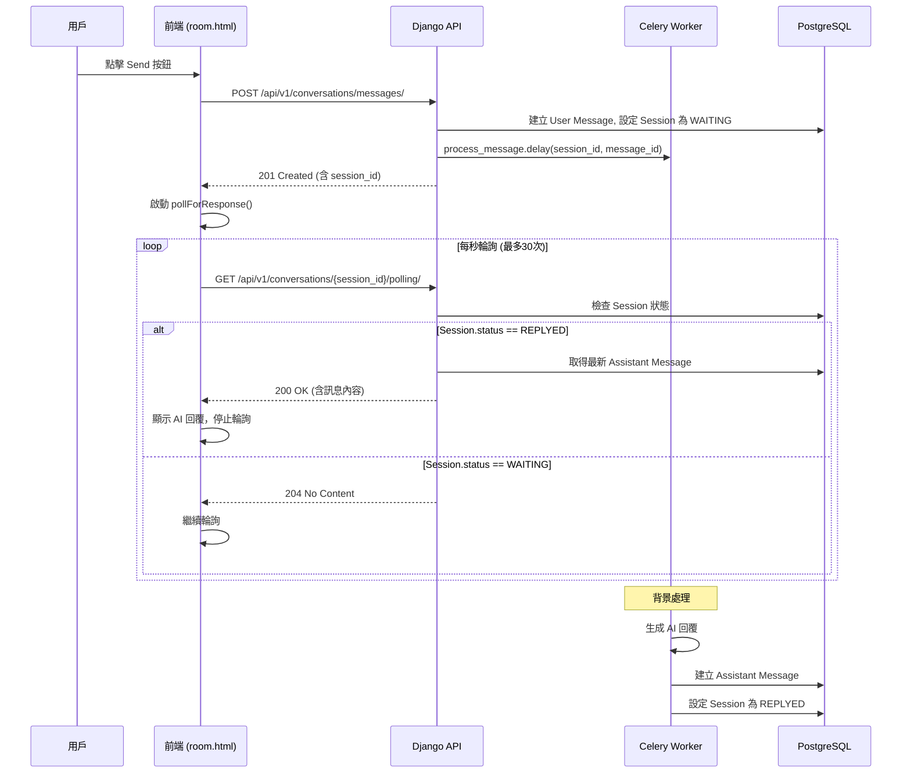

# MaiAgent GenAI 自動回覆平台

> 以 Django 為核心，結合 Celery、PostgreSQL、Elasticsearch 與 LangChain 的企業級對話系統。支援場景化配置、權限管控、非同步生成與全文檢索，協助團隊在安全可控的環境下快速導入 LLM。

## 系統架構



## 資料庫架構



## 核心組件簡介

- **Server（Django）**：提供 RESTful API 與 Web 入口，負責接收使用者訊息、寫入資料庫並觸發 Celery 任務，亦提供會話列表與全文檢索查詢功能。參考 `doc/design/RESTful_API_Design.md`。
- **PostgreSQL**：主要關聯式資料庫，儲存使用者/群組/角色與權限、場景設定、會話與訊息、任務狀態等結構化資料，透過索引與外鍵維持一致性。參考 `doc/design/Database_Design.md`。
- **Elasticsearch**：會話與訊息的全文檢索引擎，支援依角色/群組的權限邊界查詢與高亮顯示。參考 `doc/design/Elasticsearch_Fields_design.md`。
- **Celery**：非同步任務佇列，處理 LLM 生成與長耗時工作；具備 TLS 加密的 Broker、連線池與退避重試等穩定性機制。參考 `doc/design/Celery_Design.md`。
- **操作與權限模型**：以「一人一角色、一公司一群組」為邊界，對應全文檢索、場景管理與對話等操作的授權規則。參考 `doc/design/Operations_and_Permissions_Mapping.md`。

## API 說明

### 主要 API 端點

| 功能 | HTTP 方法 | URI | 權限角色 | 說明 |
|------|-----------|-----|----------|------|
| **提交對話** | POST | `/api/v1/conversations/messages/` | 員工、主管、管理員 | 發送訊息到現有會話或建立新會話 |
| **顯示所有會話** | GET | `/api/v1/conversations/` | 員工、主管、管理員 | 取得用戶可存取的會話列表 |
| **查詢特定會話** | GET | `/api/v1/conversations/{session_id}/` | 會話擁有者、管理員 | 取得會話詳細資訊和訊息 |
| **刪除特定對話** | DELETE | `/api/v1/conversations/{session_id}/` | 會話擁有者、管理員 | 刪除會話及所有相關訊息 |
| **回覆結果** | GET | `/api/v1/conversations/{session_id}/polling/` | 會話擁有者、管理員 | 輪詢取得 AI 回覆結果 |
| **更新場景設定** | PUT | `/api/v1/scenarios/{scenario_id}/` | 主管、管理員 | 更新場景的預設 LLM 模型 |
| **取得場景模型** | GET | `/api/v1/scenarios/{scenario_id}/models/` | 員工、主管、管理員 | 取得場景可用的 LLM 模型列表 |

### 權限說明

- **員工**：可以在授權場景中發送訊息、查看自己的會話、刪除自己的會話
- **主管**：擁有員工權限 + 可以管理場景設定、查看部門內會話
- **管理員**：擁有所有權限，可以存取所有會話和系統設定

## 自動回覆流程

### 完整流程步驟

1.  使用者點擊 **Send** 按鈕或按下 **Enter** 鍵。
2.  前端呼叫 `sendMessage()` 方法。
3.  前端發送 **POST** 請求到 `/api/v1/conversations/messages/`。
4.  Django API 的 `post_message_no_session()` 函式接收請求。
5.  Django API 呼叫 `post_message()` 函式處理訊息。
6.  `post_message()` 函式將使用者訊息資料傳送給資料庫，並將任務參數 `(session_id, message_id)` 傳送給 Celery。
7.  Django API 回傳成功回應 (**HTTP 201**) 給前端。
8.  前端立即啟動 `pollForResponse()` 方法。
9.  前端開始輪詢 `GET /api/v1/conversations/{session_id}/polling/`。
10. Django API 的 `polling()` 函式檢查資料庫中的 Session 狀態。
11. Celery 的 `process_message()` 函式生成 AI 回覆。
12. Celery 將 AI 回覆內容傳送給資料庫，並更新資料庫中的 Session 狀態為 **REPLYED**。
13. Django API 的 `polling()` 函式從資料庫取得最新的 Assistant Message。
14. 前端顯示 AI 回覆訊息給使用者。

### 傳送訊息時序圖



> 詳細時序圖設計請參考：[Send_Message_SequenceDiagram.md](doc/design/Send_Message_SequenceDiagram.md)

### 安全性、效能、可擴充性

#### 安全性

- **登入(JWT)**：使用 JSON Web Token 實現無狀態身份驗證，確保 API 存取的安全性與可擴展性。
- **操作控管**：透過角色權限系統 (員工/主管/管理員) 控制使用者對不同功能的存取權限，使用 django-role-permissions 套件管理角色與權限映射。
- **Celery 加密**：使用 TLS 加密保護 Celery 任務佇列通訊，確保非同步任務傳輸的資料安全。
- **API input 輸入驗證**：使用 Django REST Framework 序列化器驗證所有 API 輸入，防止惡意資料注入。
- **API 速率限制**：實施 API 呼叫頻率限制，防止濫用與 DDoS 攻擊。

#### 效能

- **Database query 效率**：使用資料庫索引與查詢最佳化，提升會話與訊息查詢的效能。
- **分頁 query**：實施分頁機制避免大量資料載入，提供流暢的使用者體驗。
- **連線池管理**：使用 PostgreSQL 連線池與 Redis 連線池，有效管理資料庫連線資源。

#### 擴充性

- **場景設定**：每個場景存放 config_json 以應對更複雜的路由邏輯，使用 LangChain 框架方便管理不同對話場景。
- **多 model**：支援多種 LLM 模型 (GPT-4o、GPT-3.5-turbo、Claude-3-sonnet)，可依場景需求彈性選擇。
- **角色可以擴充**：透過 role access 控制系統，可輕鬆新增新角色類型並設定對應權限。

#### 錯誤處理

- **狀態碼回傳**：根據遇到的狀況回傳相應的 HTTP 狀態碼，詳細說明請見 API 文件 (`doc/testing/API_TESTING_GUIDE.md` 與 `doc/design/API_Security_Performance_Design.md`)。

## 如何啟動專案

### 使用 Docker (推薦)

**重要：此專案需要同時啟動 Django 後端服務和 Webpack 前端開發伺服器才能正常運作**

#### 1. 啟動 Django 後端服務

```bash
# 1. 進入專案目錄
cd .\src\maiagent

# 2. 啟動所有服務
docker compose -f docker-compose.local.yml up -d

# 3. 建立資料庫結構 (首次執行)
docker compose -f docker-compose.local.yml exec django python manage.py makemigrations chat
docker compose -f docker-compose.local.yml exec django python manage.py migrate

# 4. 載入測試資料
docker compose -f docker-compose.local.yml exec django python manage.py load_fixtures
```

#### 2. 啟動 Webpack 前端開發伺服器

**在另一個終端視窗中執行：**

```bash
# 1. 進入專案目錄 (與上面相同)
cd .\src\maiagent

# 2. 安裝前端依賴 (首次執行)
npm install

# 3. 啟動 Webpack 開發伺服器
npm run dev
```

#### 3. 驗證啟動成功

- Webpack 開發伺服器會在 `http://localhost:8080` 提供靜態資源 (CSS/JS)
- Django 應用程式可通過 `http://localhost:8000` 存取
- **必須兩個服務都正常運行**，否則會出現樣式載入失敗或頁面無法正常顯示的問題

### 服務端點

- **Django Web**: http://localhost:8000
- **Django Admin**: http://localhost:8000/admin/
- **Chat 聊天室**: http://localhost:8000/chat/
- **API 文檔**: http://localhost:8000/api/docs/
- **Flower (Celery監控)**: http://localhost:5555
- **Redis**: localhost:6379
- **PostgreSQL**: localhost:5432
- **Elasticsearch**: http://localhost:9200

## 測試帳號

系統提供以下測試帳號，密碼均為 `admin123`：

| 使用者名稱 | 密碼 | 角色 | 部門 | 說明 |
|-----------|------|------|------|------|
| `admin` | `admin123` | 管理員 | - | 系統管理員，擁有所有權限 |
| `supervisor_it` | `admin123` | 主管 | IT部門 | IT部門主管，可管理場景設定 |
| `supervisor_sales` | `admin123` | 主管 | 銷售部門 | 銷售部門主管，可管理場景設定 |
| `employee_it_001` | `admin123` | 員工 | IT部門 | 張小明，IT部門員工 |
| `employee_sales_001` | `admin123` | 員工 | 銷售部門 | 李小華，銷售部門員工 |
| `employee_cs_001` | `admin123` | 員工 | 客服部門 | 王小美，客服部門員工 |

### 測試資料內容

**預設群組**：
- IT部門 - 資訊科技部門
- 銷售部門 - 業務銷售部門  
- 客服部門 - 客戶服務部門

**LLM 模型**：
- OpenAI GPT-4o
- OpenAI GPT-3.5-turbo
- Anthropic Claude-3-sonnet

**對話場景**：
- 客服助手 - 友善耐心的客服對話
- 技術支援 - 專業技術問題解決
- 銷售顧問 - 產品推薦與解決方案

## 管理指令

```bash
# 重設所有使用者密碼為 admin123
docker compose -f docker-compose.local.yml exec django python manage.py reset_passwords

# 清空所有資料
docker compose -f docker-compose.local.yml exec django python manage.py clear_data --all

# 重新載入測試資料
docker compose -f docker-compose.local.yml exec django python manage.py load_fixtures

# 查看系統狀態
docker compose -f docker-compose.local.yml ps
```

---

[](https://github.com/cookiecutter/cookiecutter-django/)
[](https://github.com/astral-sh/ruff)

License: MIT