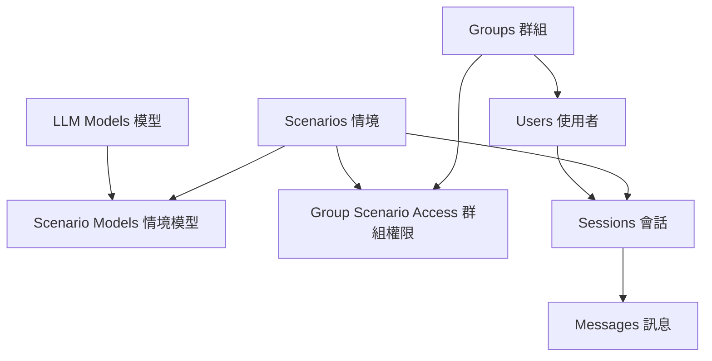

# Maiagent 系統 - Fixtures 與開發環境設置指南

## 🎯 概述

本指南說明如何快速設置 Maiagent 系統的開發環境，包括啟動服務、載入測試資料、以及使用者登入設定。

## 🚀 快速開始

### 1. 啟動所有服務

```bash
cd .\src\maiagent
docker compose -f docker-compose.local.yml up -d
```

### 2. 載入測試資料

```bash
# 在 Docker 容器中執行
docker compose -f docker-compose.local.yml exec django python manage.py load_fixtures
```

### 3. 立即可用的登入帳號

| 使用者名稱 | 密碼 | 角色 | 部門 | 說明 |
|-----------|------|------|------|------|
| `admin` | `admin123` | 管理員 | - | 系統管理員 |
| `supervisor_it` | `admin123` | 主管 | IT部門 | IT部門主管 |
| `supervisor_sales` | `admin123` | 主管 | 銷售部門 | 銷售部門主管 |
| `employee_it_001` | `admin123` | 員工 | IT部門 | 張小明 |
| `employee_sales_001` | `admin123` | 員工 | 銷售部門 | 李小華 |
| `employee_cs_001` | `admin123` | 員工 | 客服部門 | 王小美 |

> 💡 **重要**: 系統已移除電子郵件驗證要求，可以直接使用上述帳號密碼登入。

## 📁 Fixtures 資料結構

### 目錄結構
```
maiagent/fixtures/
├── README.md                         # 詳細使用說明
├── chat/                             # 聊天系統相關資料
│   ├── groups.json                   # 群組資料 (3個群組)
│   ├── llm_models.json               # LLM 模型設定 (3個模型)
│   ├── scenarios.json                # 對話情境 (3個情境)
│   ├── scenario_models.json          # 情境與模型關聯
│   ├── group_scenario_access.json    # 群組權限設定
│   ├── sessions.json                 # 對話會話範例
│   └── messages.json                 # 對話訊息範例
└── users/
    └── users.json                    # 使用者資料 (6個使用者)
```

### 預設資料內容

**群組**:
- IT部門 - 資訊科技部門
- 銷售部門 - 業務銷售部門
- 客服部門 - 客戶服務部門

**LLM 模型**:
- OpenAI GPT-4o
- OpenAI GPT-3.5-turbo  
- Anthropic Claude-3-sonnet

**對話情境**:
- 客服助手 - 友善耐心的客服對話
- 技術支援 - 專業技術問題解決
- 銷售顧問 - 產品推薦與解決方案

## 🔧 管理指令

### Fixtures 管理

```bash
# 載入所有測試資料
docker compose -f docker-compose.local.yml exec django python manage.py load_fixtures

# 模擬載入（不實際執行）
docker compose -f docker-compose.local.yml exec django python manage.py load_fixtures --dry-run

# 清空後重新載入
docker compose -f docker-compose.local.yml exec django python manage.py load_fixtures --flush

# 載入特定檔案
docker compose -f docker-compose.local.yml exec django python manage.py load_fixtures --specific maiagent/fixtures/chat/groups.json
```

### 使用者管理

```bash
# 重設所有使用者密碼為 admin123
docker compose -f docker-compose.local.yml exec django python manage.py reset_passwords

# 重設特定使用者密碼
docker compose -f docker-compose.local.yml exec django python manage.py reset_passwords --user admin --password newpassword

# 設置電子郵件驗證狀態
docker compose -f docker-compose.local.yml exec django python manage.py setup_email_verification --verify-all
```

### 資料清理

```bash
# 清空所有資料
docker compose -f docker-compose.local.yml exec django python manage.py clear_data --all

# 只清空聊天資料
docker compose -f docker-compose.local.yml exec django python manage.py clear_data --chat-only

# 只清空使用者資料
docker compose -f docker-compose.local.yml exec django python manage.py clear_data --users-only
```

## 🏗️ 系統架構

### 載入順序依賴關係



系統自動按以下順序載入：
1. 基礎資料：groups.json → llm_models.json → scenarios.json
2. 關聯資料：scenario_models.json
3. 使用者資料：users.json
4. 權限設定：group_scenario_access.json
5. 會話資料：sessions.json → messages.json

## ⚙️ 設定修改

### 關閉電子郵件驗證

系統已預設關閉電子郵件驗證，相關設定：

```python
# config/settings/base.py
ACCOUNT_EMAIL_VERIFICATION = "none"  # 已設為 "none"
```

如需重新開啟驗證，請修改為：
```python
ACCOUNT_EMAIL_VERIFICATION = "mandatory"
```

## 🔍 疑難排解

### 常見問題

**1. 無法登入**
```bash
# 重設密碼
docker compose -f docker-compose.local.yml exec django python manage.py reset_passwords

# 檢查使用者狀態
docker compose -f docker-compose.local.yml exec django python manage.py shell -c "from maiagent.users.models import User; [print(f'{u.username}: active={u.is_active}') for u in User.objects.all()]"
```

**2. 電子郵件驗證問題**
```bash
# 驗證所有電子郵件
docker compose -f docker-compose.local.yml exec django python manage.py setup_email_verification --verify-all
```

**3. 資料載入錯誤**
```bash
# 清空後重新載入
docker compose -f docker-compose.local.yml exec django python manage.py clear_data --all
docker compose -f docker-compose.local.yml exec django python manage.py load_fixtures
```

**4. 容器問題**
```bash
# 重新啟動所有服務
docker compose -f docker-compose.local.yml down
docker compose -f docker-compose.local.yml up -d

# 查看容器狀態
docker compose -f docker-compose.local.yml ps
```

### 服務端點

- **Django Web**: http://localhost:8000
- **Django Admin**: http://localhost:8000/admin/
- **API 文檔**: http://localhost:8000/api/docs/
- **Flower (Celery監控)**: http://localhost:5555
- **Redis**: localhost:6379
- **PostgreSQL**: localhost:5432
- **Elasticsearch**: http://localhost:9200

## 🔐 安全須知

1. **密碼安全**: 所有預設密碼都是 `admin123`，正式環境請務必修改
2. **測試資料**: Fixtures 中的資料僅供開發測試使用，不應用於正式環境
3. **電子郵件**: 系統已關閉電子郵件驗證，正式環境建議重新啟用

## 📊 資料統計

載入完成後的資料統計：
- 群組: 3 筆
- LLM 模型: 3 筆
- 情境: 3 筆
- 使用者: 6 筆
- 會話: 3 筆
- 訊息: 6 筆

## 🎯 下一步

1. 使用任意測試帳號登入系統
2. 探索不同角色的功能權限
3. 測試聊天對話功能
4. 根據需求調整 LLM 模型設定
5. 新增自定義的測試資料

---

💡 **提示**: 如需更詳細的技術說明，請參考 `maiagent/fixtures/README.md`