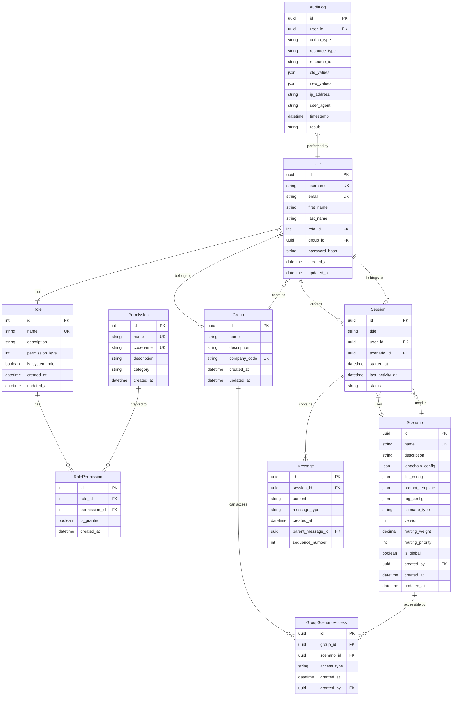

```mermaid
erDiagram
    %% 簡化後的使用者與權限相關實體
    User }|--|| Role : has
    User }|--o| Group : "belongs to"
    User ||--o{ Session : creates
    
    Role ||--o{ RolePermission : has
    Permission ||--o{ RolePermission : "granted to"
    
    %% 群組相關實體 (簡化為公司概念)
    Group ||--o{ User : contains
    Group ||--o{ GroupScenarioAccess : "can access"
    
    %% 場景相關實體
    Scenario ||--o{ GroupScenarioAccess : "accessible by"
    Scenario ||--o{ Session : "used in"
    
    %% 會話相關實體
    Session ||--o{ Message : contains
    Session }|--|| User : "belongs to"
    Session }|--|| Scenario : uses
    
    %% 稽核相關實體
    AuditLog }|--|| User : "performed by"
    
    %% 實體屬性定義
    User {
        uuid id PK
        string username UK
        string email UK
        string first_name
        string last_name
        int role_id FK
        uuid group_id FK
        string password_hash
        datetime created_at
        datetime updated_at
    }
    
    Role {
        int id PK
        string name UK
        string description
        int permission_level
        boolean is_system_role
        datetime created_at
        datetime updated_at
    }
    
    Permission {
        int id PK
        string name UK
        string codename UK
        string description
        string category
        datetime created_at
    }
    
    Group {
        uuid id PK
        string name
        string description
        string company_code UK
        datetime created_at
        datetime updated_at
    }
    
    Scenario {
        uuid id PK
        string name UK
        string description
        json langchain_config
        json llm_config
        json prompt_template
        json rag_config
        string scenario_type
        int version
        decimal routing_weight
        int routing_priority
        boolean is_global
        uuid created_by FK
        datetime created_at
        datetime updated_at
    }
    
    Session {
        uuid id PK
        string title
        uuid user_id FK
        uuid scenario_id FK
        datetime started_at
        datetime last_activity_at
        string status
    }
    
    Message {
        uuid id PK
        uuid session_id FK
        string content
        string message_type
        datetime created_at
        uuid parent_message_id FK
        int sequence_number
    }
    
    RolePermission {
        int id PK
        int role_id FK
        int permission_id FK
        boolean is_granted
        datetime created_at
    }
    
    GroupScenarioAccess {
        uuid id PK
        uuid group_id FK
        uuid scenario_id FK
        string access_type
        datetime granted_at
        uuid granted_by FK
    }
    
    AuditLog {
        uuid id PK
        uuid user_id FK
        string action_type
        string resource_type
        string resource_id
        json old_values
        json new_values
        string ip_address
        string user_agent
        datetime timestamp
        string result
    }
```