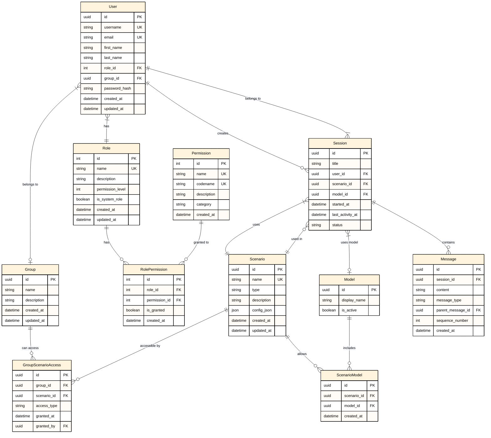

```mermaid
%%{init: {"theme":"base","themeVariables":{"lineColor":"#000000","textColor":"#000000","primaryTextColor":"#000000","secondaryTextColor":"#000000","tertiaryTextColor":"#000000","primaryBorderColor":"#000000","secondaryBorderColor":"#000000","tertiaryBorderColor":"#000000"}}}%%
erDiagram
    %% 使用者與權限相關實體
    User }|--|| Role : has
    User }|--o| Group : "belongs to"
    User ||--o{ Session : creates

    Role ||--o{ RolePermission : has
    Permission ||--o{ RolePermission : "granted to"

    %% 群組與場景相關
    Group ||--o{ GroupScenarioAccess : "can access"
    Scenario ||--o{ GroupScenarioAccess : "accessible by"
    Scenario ||--o{ Session : "used in"

    %% 模型與場景的多對多
    Scenario ||--o{ ScenarioModel : "allows"
    Model ||--o{ ScenarioModel : "includes"

    %% 會話與訊息
    Session ||--o{ Message : contains
    Session }|--|| User : "belongs to"
    Session }|--|| Scenario : uses
    Session }|--o| Model : "uses model"

    %% 實體屬性定義
    User {
        uuid id PK
        string username UK
        string email UK
        string first_name
        string last_name
        int role_id FK
        uuid group_id FK
        string password_hash
        datetime created_at
        datetime updated_at
    }

    Role {
        int id PK
        string name UK
        string description
        int permission_level
        boolean is_system_role
        datetime created_at
        datetime updated_at
    }

    Permission {
        int id PK
        string name UK
        string codename UK
        string description
        string category
        datetime created_at
    }

    RolePermission {
        int id PK
        int role_id FK
        int permission_id FK
        boolean is_granted
        datetime created_at
    }

    Group {
        uuid id PK
        string name
        string description
        datetime created_at
        datetime updated_at
    }

    Scenario {
        uuid id PK
        string name UK
        string type
        string description
        json config_json
        datetime created_at
        datetime updated_at
    }

    Model {
        uuid id PK
        string display_name
        boolean is_active
    }

    ScenarioModel {
        uuid id PK
        uuid scenario_id FK
        uuid model_id FK
        datetime created_at
    }

    GroupScenarioAccess {
        uuid id PK
        uuid group_id FK
        uuid scenario_id FK
        string access_type
        datetime granted_at
        uuid granted_by FK
    }

    Session {
        uuid id PK
        string title
        uuid user_id FK
        uuid scenario_id FK
        uuid model_id FK
        datetime started_at
        datetime last_activity_at
        string status
    }

    Message {
        uuid id PK
        uuid session_id FK
        string content
        string message_type
        uuid parent_message_id FK
        int sequence_number
        datetime created_at
    }
```