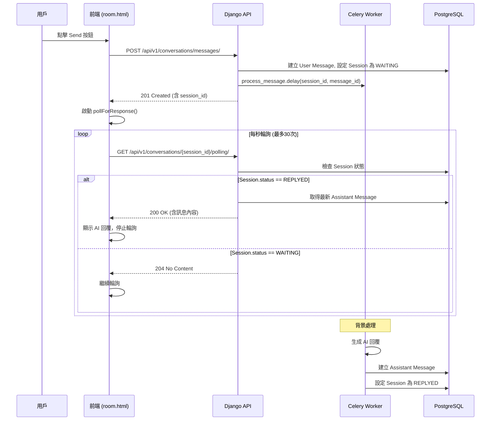

```mermaid
sequenceDiagram
    participant User as 用戶
    participant Frontend as 前端 (room.html)
    participant API as Django API
    participant Celery as Celery Worker
    participant DB as PostgreSQL

    User->>Frontend: 點擊 Send 按鈕
    Frontend->>API: POST /api/v1/conversations/messages/
    API->>DB: 建立 User Message, 設定 Session 為 WAITING
    API->>Celery: process_message.delay(session_id, message_id)
    API-->>Frontend: 201 Created (含 session_id)
    
    Frontend->>Frontend: 啟動 pollForResponse()
    
    loop 每秒輪詢 (最多30次)
        Frontend->>API: GET /api/v1/conversations/{session_id}/polling/
        API->>DB: 檢查 Session 狀態
        
        alt Session.status == REPLYED
            API->>DB: 取得最新 Assistant Message
            API-->>Frontend: 200 OK (含訊息內容)
            Frontend->>Frontend: 顯示 AI 回覆，停止輪詢
        else Session.status == WAITING
            API-->>Frontend: 204 No Content
            Frontend->>Frontend: 繼續輪詢
        end
    end
    
    Note over Celery: 背景處理
    Celery->>Celery: 生成 AI 回覆
    Celery->>DB: 建立 Assistant Message
    Celery->>DB: 設定 Session 為 REPLYED
```