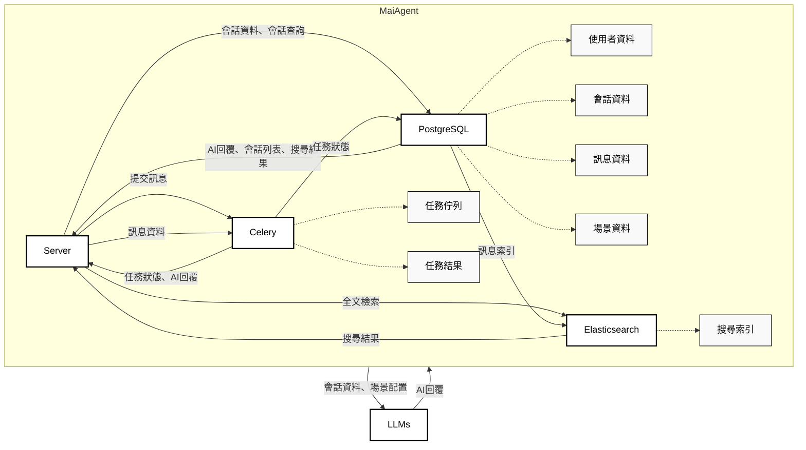

# MaiAgent 系統架構圖

## 系統架構概述

本架構圖展示了 MaiAgent GenAI 自動回覆平台的核心系統架構，包含主要實體、資料儲存和資料流向。

## 架構圖

## 架構說明

### 主要實體 (Entities)
- **MaiAgent**: 主要系統平台，包含四個核心組件
- **LLM**: 各種 LLMs

### MaiAgent 核心組件 (Components)
- **Server**: 應用伺服器，處理請求和回應協調
- **PostgreSQL**: 主要關聯式資料庫，儲存結構化資料
- **Elasticsearch**: 全文檢索引擎，提供進階搜尋功能
- **Celery**: 非同步任務佇列系統，處理 AI 生成任務

### 資料存儲 (Data)
- **使用者資料**: 使用者基本資訊與權限
- **會話資料**: 對話會話的基本資訊
- **訊息資料**: 對話訊息內容
- **場景資料**: AI 場景配置與設定
- **搜尋索引**: Elasticsearch 的全文檢索索引
- **任務佇列**: Celery 的非同步任務佇列
- **任務結果**: 任務執行結果與狀態
